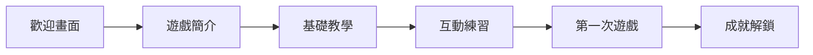

# 🚴‍♂️ 一日北高 - UI/UX 設計指南

## 目錄
1. [設計理念](#設計理念)
2. [視覺風格指南](#視覺風格指南)
3. [色彩系統](#色彩系統)
4. [排版系統](#排版系統)
5. [組件系統](#組件系統)
6. [畫面設計](#畫面設計)
7. [動畫系統](#動畫系統)
8. [響應式設計](#響應式設計)
9. [使用者體驗流程](#使用者體驗流程)

---

## 設計理念

### 核心價值
- **動感活力**：體現腳踏車運動的速度感與活力
- **團隊協作**：強調團隊合作的重要性
- **策略深度**：展現遊戲的策略性與教育意義
- **親和易用**：降低學習門檻，提升參與度

### 設計原則
1. **清晰層級**：資訊架構明確，重要資訊突出
2. **即時回饋**：每個操作都有視覺或聽覺回饋
3. **漸進披露**：逐步引導玩家理解複雜概念
4. **沉浸體驗**：透過視覺和動畫營造騎行氛圍

---

## 視覺風格指南

### 整體風格
- **風格定位**：現代運動風 + 輕量遊戲化
- **視覺語言**：扁平化設計搭配微質感
- **圖形風格**：幾何化圖標，流線型元素
- **插畫風格**：簡約線條插畫，強調動態感

### 設計特徵
- 使用漸層色彩營造速度感
- 斜線和動態線條表現運動感
- 圓角設計提升親和力
- 陰影層次創造空間深度

---

## 色彩系統

### 主色調
```css
/* 主要色彩 */
--primary-orange: #FF6B35;    /* 活力橘 - 主要行動色 */
--primary-blue: #4A90E2;      /* 天空藍 - 次要色彩 */
--primary-green: #52C41A;     /* 能量綠 - 成功狀態 */

/* 輔助色彩 */
--accent-yellow: #FFD93D;     /* 陽光黃 - 強調色 */
--accent-purple: #6C5CE7;     /* 競速紫 - 特殊元素 */
--accent-red: #FF4757;        /* 警示紅 - 警告/體力低 */

/* 中性色 */
--neutral-900: #1A1A2E;       /* 深夜藍 - 主要文字 */
--neutral-700: #373A47;       /* 暗灰 - 次要文字 */
--neutral-500: #6B7280;       /* 中灰 - 輔助文字 */
--neutral-300: #D1D5DB;       /* 淺灰 - 邊框 */
--neutral-100: #F3F4F6;       /* 背景灰 */
--neutral-50: #FAFBFC;        /* 淺背景 */

/* 漸層色 */
--gradient-sunset: linear-gradient(135deg, #FF6B35 0%, #FFD93D 100%);
--gradient-sky: linear-gradient(135deg, #4A90E2 0%, #52C41A 100%);
--gradient-speed: linear-gradient(90deg, #6C5CE7 0%, #4A90E2 100%);
```

### 色彩使用規則
- **主要行動**：使用活力橘 (CTA按鈕、重要操作)
- **次要行動**：使用天空藍 (次要按鈕、連結)
- **成功狀態**：使用能量綠 (完成、達成目標)
- **警告狀態**：使用警示紅 (體力不足、警告)
- **特殊獎勵**：使用競速紫 (稀有物品、成就)

---

## 排版系統

### 字體選擇
```css
/* 字體堆疊 */
--font-primary: 'Noto Sans TC', 'Microsoft JhengHei', sans-serif;
--font-display: 'Bebas Neue', 'Impact', sans-serif;  /* 標題/數字 */
--font-mono: 'JetBrains Mono', 'Consolas', monospace; /* 數據顯示 */

/* 字體大小 - Tailwind 規範 */
--text-xs: 0.75rem;     /* 12px - 標籤、輔助文字 */
--text-sm: 0.875rem;    /* 14px - 次要內容 */
--text-base: 1rem;      /* 16px - 主要內容 */
--text-lg: 1.125rem;    /* 18px - 強調內容 */
--text-xl: 1.25rem;     /* 20px - 小標題 */
--text-2xl: 1.5rem;     /* 24px - 段落標題 */
--text-3xl: 1.875rem;   /* 30px - 頁面標題 */
--text-4xl: 2.25rem;    /* 36px - 主標題 */
--text-5xl: 3rem;       /* 48px - 特大標題 */

/* 字重 */
--font-light: 300;
--font-normal: 400;
--font-medium: 500;
--font-semibold: 600;
--font-bold: 700;

/* 行高 */
--leading-tight: 1.25;
--leading-snug: 1.375;
--leading-normal: 1.5;
--leading-relaxed: 1.625;
```

---

## 組件系統

### 按鈕系統
```css
/* 主要按鈕 */
.btn-primary {
  background: var(--gradient-sunset);
  color: white;
  padding: 12px 32px;
  border-radius: 8px;
  font-weight: 600;
  transition: transform 0.2s, box-shadow 0.2s;
  box-shadow: 0 4px 12px rgba(255, 107, 53, 0.3);
}

.btn-primary:hover {
  transform: translateY(-2px);
  box-shadow: 0 6px 20px rgba(255, 107, 53, 0.4);
}

/* 次要按鈕 */
.btn-secondary {
  background: white;
  color: var(--primary-blue);
  border: 2px solid var(--primary-blue);
  padding: 10px 28px;
  border-radius: 8px;
  font-weight: 500;
}

/* 圖標按鈕 */
.btn-icon {
  width: 48px;
  height: 48px;
  border-radius: 50%;
  display: flex;
  align-items: center;
  justify-content: center;
  background: white;
  box-shadow: 0 2px 8px rgba(0,0,0,0.1);
}
```

### 卡片系統
```css
/* 基礎卡片 */
.card {
  background: white;
  border-radius: 12px;
  padding: 24px;
  box-shadow: 0 4px 16px rgba(0,0,0,0.08);
  transition: transform 0.3s, box-shadow 0.3s;
}

.card:hover {
  transform: translateY(-4px);
  box-shadow: 0 8px 24px rgba(0,0,0,0.12);
}

/* 角色卡片 */
.character-card {
  position: relative;
  overflow: hidden;
  border: 2px solid transparent;
  background: linear-gradient(white, white) padding-box,
              var(--gradient-speed) border-box;
}

/* 裝備卡片 */
.equipment-card {
  display: grid;
  grid-template-columns: 80px 1fr;
  gap: 16px;
  align-items: center;
}
```

### 進度條系統
```css
/* 體力條 */
.stamina-bar {
  height: 8px;
  background: var(--neutral-300);
  border-radius: 4px;
  overflow: hidden;
}

.stamina-fill {
  height: 100%;
  background: linear-gradient(90deg, #52C41A, #FFD93D);
  transition: width 0.3s ease;
}

/* 進度條 */
.progress-bar {
  position: relative;
  height: 32px;
  background: var(--neutral-100);
  border-radius: 16px;
  overflow: hidden;
}

.progress-fill {
  height: 100%;
  background: var(--gradient-sunset);
  display: flex;
  align-items: center;
  justify-content: flex-end;
  padding-right: 12px;
  color: white;
  font-weight: 600;
}
```

---

## 畫面設計

### 1. 主選單畫面
```
┌─────────────────────────────────────┐
│           [Logo + 動態背景]          │
│                                     │
│         一 日 北 高 挑 戰            │
│                                     │
│      [開始遊戲] - 主要CTA按鈕        │
│      [教學模式] - 次要按鈕           │
│      [排行榜]   - 次要按鈕           │
│      [設定]     - 圖標按鈕           │
│                                     │
│    [社群分享圖標] [音效開關]         │
└─────────────────────────────────────┘
```

**設計要點**：
- 動態背景：使用 GSAP 製作騎行剪影動畫
- Logo 動畫：載入時的縮放彈跳效果
- 按鈕懸停：微浮動 + 光暈效果
- 背景音樂：輕快的運動節奏

### 2. 團隊選擇畫面
```
┌─────────────────────────────────────┐
│  選擇你的團隊 (0/4)        [返回]   │
├─────────────────────────────────────┤
│                                     │
│  [角色卡片網格 - 3x3]               │
│  ┌────┐ ┌────┐ ┌────┐              │
│  │破風手│ │爬坡手│ │衝刺手│         │
│  └────┘ └────┘ └────┘              │
│  ┌────┐ ┌────┐ ┌────┐              │
│  │耐力型│ │全能型│ │輔助型│         │
│  └────┘ └────┘ └────┘              │
│                                     │
├─────────────────────────────────────┤
│  已選擇團隊：                       │
│  [成員1] [成員2] [成員3] [成員4]    │
│                                     │
│              [確認團隊]             │
└─────────────────────────────────────┘
```

**互動設計**：
- 點擊選擇：卡片翻轉動畫顯示詳細資訊
- 拖曳排序：已選成員可拖曳調整順序
- 能力雷達圖：即時顯示團隊綜合能力
- 建議提示：智慧提示團隊配置建議

### 3. 裝備配置畫面
```
┌─────────────────────────────────────┐
│  裝備配置              [自動配置]   │
├─────────────────────────────────────┤
│                                     │
│  [腳踏車3D模型展示區]               │
│     - 可旋轉查看                   │
│     - 零件高亮顯示                 │
│                                     │
├─────────────────────────────────────┤
│  零件選擇：                         │
│  車架 [選擇▼]  輪組 [選擇▼]        │
│  變速 [選擇▼]  煞車 [選擇▼]        │
│  座墊 [選擇▼]  把手 [選擇▼]        │
│                                     │
│  總重量: 8.5kg  空氣阻力: 低        │
│  預算: $45,000 / $50,000           │
└─────────────────────────────────────┘
```

**3D 互動**：
- Three.js 渲染腳踏車模型
- 點擊零件：彈出選擇面板
- 即時預覽：更換零件的視覺效果
- 性能對比：顯示升級前後差異

### 4. 隊形編排畫面
```
┌─────────────────────────────────────┐
│  破風隊形編排          [預設隊形▼]  │
├─────────────────────────────────────┤
│                                     │
│        前方 ↑                       │
│                                     │
│         [1]                         │
│       /     \                       │
│     [2]     [3]                    │
│       \     /                       │
│         [4]                         │
│                                     │
│  風阻降低: 35%  體力消耗: -20%      │
│                                     │
│  [隊形說明] [模擬測試] [確認隊形]   │
└─────────────────────────────────────┘
```

**拖放互動**：
- 拖曳成員：調整隊形位置
- 風向指示：動態箭頭顯示風向
- 效果預覽：即時計算風阻效果
- 隊形模板：快速套用經典隊形

### 5. 準備階段畫面
```
┌─────────────────────────────────────┐
│  賽前準備        剩餘時間: 5:00     │
├─────────────────────────────────────┤
│                                     │
│  準備項目：                         │
│  ☐ 團隊訓練 (提升默契度)           │
│  ☐ 體能訓練 (提升耐力)             │
│  ☐ 路線研究 (解鎖捷徑)             │
│  ☐ 補給準備 (增加補給點)           │
│  ☐ 天氣確認 (獲得天氣加成)         │
│                                     │
│  準備度: ████████░░ 80%            │
│                                     │
│         [開始挑戰]                  │
└─────────────────────────────────────┘
```

**時間管理**：
- 倒數計時：視覺化時間壓力
- 快速決策：拖曳分配準備時間
- 成效預覽：顯示各項準備的影響
- 智慧建議：根據隊伍特性推薦

### 6. 遊戲進行畫面
```
┌─────────────────────────────────────┐
│  台北 ━━━━━●━━━━━━━━━━━━ 高雄       │
│         125km / 380km               │
├─────────────────────────────────────┤
│                                     │
│  [騎行動畫視圖]                     │
│   - 側視角顯示隊伍                 │
│   - 背景捲動效果                   │
│   - 天氣效果疊加                   │
│                                     │
├─────────────────────────────────────┤
│ 速度: 32 km/h  時間: 04:25:30       │
│ 團隊體力: ████████░░ 75%           │
│                                     │
│ [破風] [衝刺] [補給] [休息]         │
└─────────────────────────────────────┘
```

**即時反饋**：
- 速度表：動態指針顯示當前速度
- 體力系統：個人/團隊體力條
- 事件觸發：隨機事件彈出提示
- 策略選擇：關鍵時刻的決策點

### 7. 結果畫面
```
┌─────────────────────────────────────┐
│         挑 戰 完 成！               │
│                                     │
│    總時間：13小時45分鐘             │
│    平均速度：27.6 km/h              │
│                                     │
│    獲得評級：⭐⭐⭐⭐               │
│                                     │
│  統計數據：                         │
│  • 破風效率：85%                   │
│  • 體力管理：A級                   │
│  • 團隊協作：92分                  │
│  • 路線選擇：最佳                  │
│                                     │
│  [分享成績] [再次挑戰] [返回主選單] │
└─────────────────────────────────────┘
```

**數據視覺化**：
- 成績動畫：數字跳動效果
- 路線回放：快速回顧騎行路線
- 成就解鎖：新成就彈出動畫
- 排行榜：與其他玩家比較

---

## 動畫系統

### GSAP 動畫庫配置
```javascript
// 全域動畫設定
gsap.defaults({
  ease: "power2.inOut",
  duration: 0.3
});

// 頁面轉場
const pageTransition = {
  in: {
    opacity: 0,
    x: 100,
    duration: 0.5,
    stagger: 0.1
  },
  out: {
    opacity: 0,
    x: -100,
    duration: 0.3
  }
};

// 卡片進入動畫
gsap.from(".card", {
  scrollTrigger: {
    trigger: ".card",
    start: "top 80%"
  },
  y: 50,
  opacity: 0,
  duration: 0.6,
  stagger: 0.1
});

// 騎行動畫
const cyclingAnimation = gsap.timeline({repeat: -1})
  .to(".cyclist", {
    x: "100vw",
    duration: 10,
    ease: "none"
  })
  .to(".wheel", {
    rotation: 1080,
    duration: 10,
    ease: "none"
  }, 0);

// 數字跳動
gsap.to(".counter", {
  innerText: targetValue,
  duration: 2,
  snap: {innerText: 1},
  ease: "power1.inOut"
});
```

### 微互動動畫
1. **按鈕懸停**：縮放 1.05 + 陰影加深
2. **卡片選中**：邊框發光 + 輕微放大
3. **拖曳反饋**：半透明 + 跟隨游標
4. **載入動畫**：腳踏車輪胎旋轉
5. **成功提示**：彈跳 + 星星粒子

---

## 響應式設計

### 斷點設定 (Tailwind)
```css
/* 斷點定義 */
--screen-sm: 640px;   /* 手機橫向 */
--screen-md: 768px;   /* 平板直向 */
--screen-lg: 1024px;  /* 平板橫向/小筆電 */
--screen-xl: 1280px;  /* 桌機 */
--screen-2xl: 1536px; /* 大螢幕 */
```

### 響應式策略

#### 手機版 (< 768px)
- **單欄布局**：所有內容垂直排列
- **底部導航**：固定底部操作列
- **手勢操作**：滑動切換畫面
- **簡化資訊**：隱藏次要數據
- **全螢幕模式**：遊戲時進入全螢幕

#### 平板版 (768px - 1024px)
- **雙欄布局**：主要內容 + 側邊資訊
- **觸控優化**：加大可點擊區域
- **浮動面板**：可收合的資訊面板
- **橫向優化**：自動旋轉提示

#### 桌面版 (> 1024px)
- **多欄布局**：充分利用螢幕空間
- **懸停效果**：豐富的滑鼠互動
- **鍵盤快捷**：支援快捷鍵操作
- **多窗口**：支援同時開啟多個面板

---

## 使用者體驗流程

### 新手引導流程


1. **歡迎動畫**：展示遊戲主題
2. **核心概念**：3張圖解說明玩法
3. **互動教學**：手把手引導操作
4. **練習模式**：簡化版體驗
5. **正式遊戲**：完整功能解鎖
6. **成就系統**：激勵持續遊玩

### 遊戲循環設計
```
準備階段 (3-5分鐘)
    ↓
遊戲進行 (10-15分鐘)
    ↓
結果展示 (1-2分鐘)
    ↓
分享/重玩
```

### 難度曲線
- **新手**：自動建議、提示豐富、容錯度高
- **進階**：部分自動、策略深化、挑戰增加
- **專家**：全手動、時間壓力、極限挑戰

### 獎勵機制
1. **即時獎勵**：每次正確決策的視覺反饋
2. **階段獎勵**：完成關卡的成就徽章
3. **長期目標**：收集全部角色/裝備
4. **社交獎勵**：排行榜、好友挑戰

---

## 無障礙設計

### WCAG 2.1 AA 標準
- **色彩對比**：文字 4.5:1，UI元素 3:1
- **鍵盤導航**：所有功能可鍵盤操作
- **螢幕閱讀器**：完整 ARIA 標籤
- **文字縮放**：支援 200% 縮放不破版

### 無障礙功能
```html
<!-- 按鈕範例 -->
<button
  aria-label="開始遊戲"
  aria-pressed="false"
  role="button"
  tabindex="0">
  <span>開始挑戰</span>
</button>

<!-- 進度條範例 -->
<div
  role="progressbar"
  aria-valuenow="75"
  aria-valuemin="0"
  aria-valuemax="100"
  aria-label="團隊體力">
  <div class="progress-fill" style="width: 75%">75%</div>
</div>
```

---

## 性能優化

### 圖片優化
- 使用 WebP 格式（fallback 到 JPG）
- 延遲載入非關鍵圖片
- 響應式圖片尺寸
- SVG 圖標系統

### 動畫性能
- 使用 CSS transform 而非 position
- GPU 加速屬性 (will-change)
- 減少重排 (reflow) 和重繪 (repaint)
- RequestAnimationFrame 節流

### 代碼分割
- 路由級別懶加載
- 組件按需載入
- 第三方庫分離打包
- Service Worker 快取

---

## 實作建議

### 技術棧建議
- **框架**：React 18 + TypeScript
- **路由**：React Router v6
- **狀態管理**：Zustand / Redux Toolkit
- **樣式**：Tailwind CSS + CSS Modules
- **動畫**：GSAP + Framer Motion
- **3D渲染**：Three.js / React Three Fiber
- **音效**：Howler.js
- **PWA**：Workbox

### 開發優先級
1. **Phase 1**：核心遊戲循環（團隊選擇→裝備→遊戲）
2. **Phase 2**：動畫效果、音效整合
3. **Phase 3**：3D模型、進階互動
4. **Phase 4**：社交功能、排行榜
5. **Phase 5**：成就系統、長期目標

---

## 總結

這套 UI/UX 設計方案以「動感」、「策略」、「團隊」為核心，透過現代化的視覺設計和流暢的互動體驗，將「一日北高」的挑戰轉化為引人入勝的遊戲體驗。設計不僅注重視覺吸引力，更著重於教育意義的傳達，讓玩家在享受遊戲的同時，真正理解團隊合作和策略規劃的重要性。